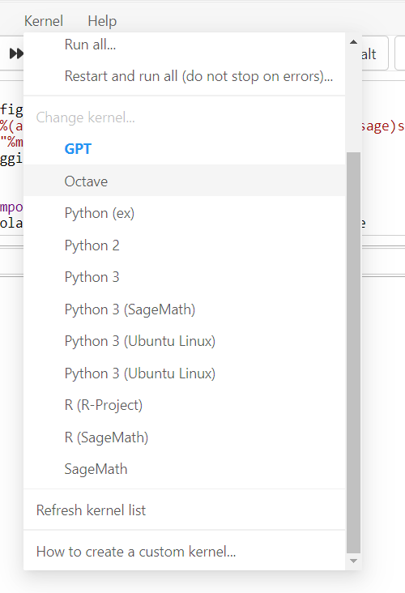

## Setup

Go to the coding center or cocalc and create a new project. Then, create a linux terminal file in cocalc where you can run scripts and commands.

Clone the repo as so:
`git clone https://github.com/organization-x/DS-Notebooks-Summer-2022.git`

cd into the repo folder like so:
`cd DS-Notebooks-Summer-2022`

Once you do that there should be two bash scripts that you can call. The first one downloads conda and creates the conda virtual environment. To run it, execute the following command:
`source create_conda_env.sh`

After that, restart the project, letting cocalc enact the changes. After restarting the project and going back into the terminal, you should see that each prompt starts with "base." If you aren't already in the DS-Notebooks-Summer-2022 repo, do:
`cd DS-Notebooks-Summer-2022`

Once there, you can run the next bash script. This sets up the ipykernels that serve as the backend to your jupyter notebooks: 
`source init_pykernels.sh`

After that, create a new notebook and connect it to a kernel by clicking on the kernel tab and selecting the kernel that is called "Python (ds_env)"

If you cannot run cells right now, you might need to kickstart the notebook by running the "validate" button on top and waiting a minute for the backend/kernel to get setup. 